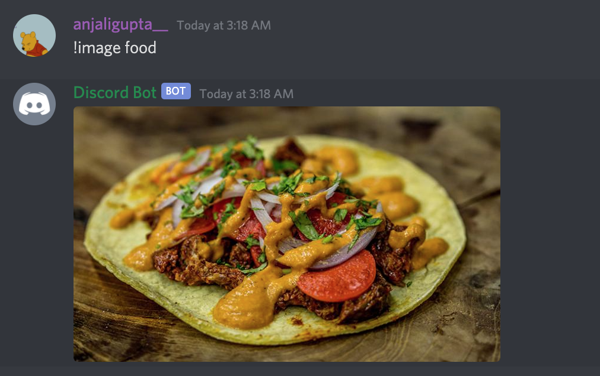
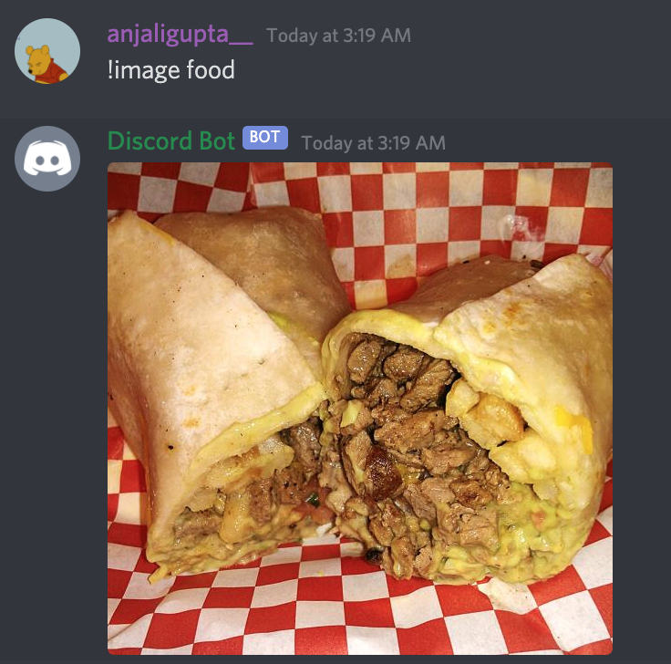

### Photo-Bot

## General Function
Created a Discord Bot that shows random images with the prompt !image {add words here}. It uses the dogpile search engine to generate a list of images with the words entered by the user and outputs a random image each time from the list.

Currently being used my friends for various online games.

## Using the Bot (images of bot in use)

